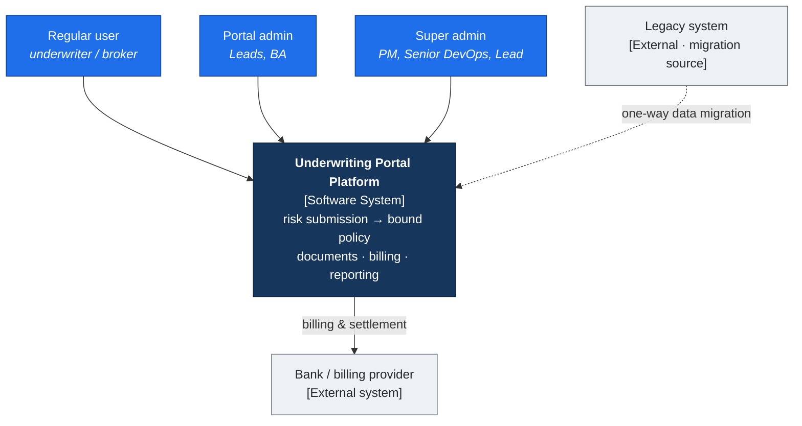
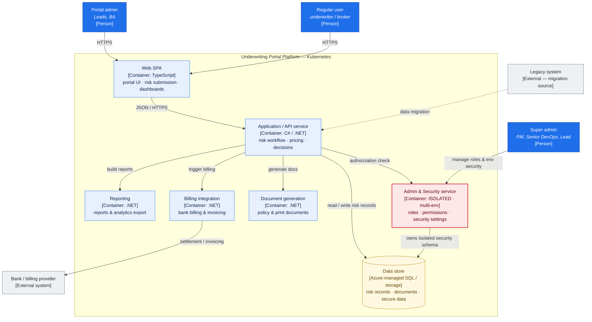
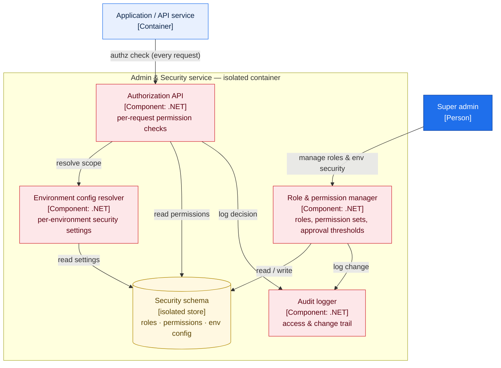

# Architecture Appendix — C4 Model

**System:** Underwriting & Insurance Portal Platform (Wonderland Inc.)
A layered C4 walkthrough — from the system in its environment (L1), down through its containers (L2), to a component zoom on the decision that defined the architecture: the isolated Admin & Security service (L3).

> Diagrams are Mermaid (diagrams-as-code) so they version with the codebase rather than going stale as exported images.

---

## Level 1 — System Context

Who uses the platform and what it talks to.

**Read:** three personas with distinct authority levels; two external edges — settlement with the bank, and a one-directional migration from the legacy system being replaced.

---

## Level 2 — Containers

Zooming inside the system boundary. All application containers run on Kubernetes.

**Read:** the .NET application service is the hub; document generation, billing, and reporting are focused containers behind it. The **Admin & Security service (red) is deliberately isolated** — every API request runs an authorization check against it, and it owns its own security schema.

---

## Level 3 — Component zoom · Admin & Security service

The decision that defined the architecture. Breaking the isolated container into its components shows *how* access is governed across environments without other services touching the full database.

**Read:**
- **Authorization API** is the single entry point for every permission check — services never evaluate access themselves.
- **Role & permission manager** is the only writer of roles, permission sets, and approval thresholds; the super admin operates here.
- **Environment config resolver** applies per-environment security settings, which is what makes multi-environment governance possible without duplicating data.
- **Audit logger** keeps an access and change trail — important in a regulated insurance context.
- The **isolated security schema** is the boundary: it holds all access state, separate from the operational data the rest of the platform reads and writes.

**Why it matters (the decision):** centralizing authorization and giving security its own isolated store means access can be reasoned about, changed, and audited in one place, across every environment, **without granting other services reach into the full database** — a smaller attack surface and a smaller blast radius. _(Decision class: influenced/advocated during the define phase.)_

---

### Notes
- Component names in L3 are a clean, defensible decomposition; align them to the actual service names if you publish this for a specific reviewer.
- For an interview, L1 is your opening slide, L2 is the main discussion, and L3 is the "go deeper" you pull out when asked about security or multi-tenancy.
