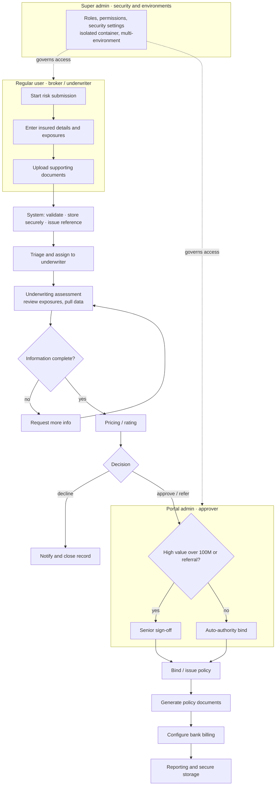

# B2B Case Study — Underwriting & Insurance Portal Platform

> **Anonymized label:** Wonderland Inc. · **Domain:** fintech / insurance underwriting · **Portfolio of risk:** $100M+
> _Sanitization note: company identity abstracted; metrics expressed as ranges/direction; diagrams redrawn as patterns, not internal exports._

---

## 1. Summary

Helped build a B2B portal for fintech and underwriting products from zero, migrating a legacy monolith to a modern, container-based platform as ownership moved to a child company. Progressed from developer to Senior Team Lead, **directly owning the configuration team and delivery flow** while **coordinating up to ~30 cross-functional contributors** (Dev, QA, DevOps, BA, PM) and the client. Headline outcome: a three-portal request originally scoped at ~6 months shipped to production in ~4 months by restructuring it as a parent/child parallel build.

---

## 2. Context & problem

The client operated a legacy underwriting system (`[legacy system]`) that needed to be migrated and re-architected while ownership transferred to a child company. The new platform had to:

- digitize the **insurance-record (risk) workflow** end to end;
- **generate and print policy and supporting documents**;
- handle **bank billing and reporting**;
- **store data securely** under compliance constraints;
- support **fast, repeatable deployment**.

The product was built from zero against a parent reference, with **configuration and development split** as separate disciplines.

**Constraints** — _[add specifics]_:
- Legacy system: `[legacy system]`
- Compliance: `[add: e.g. data residency / audit / SOC2 / regulatory regime]`
- Timeline: `[add]`
- Budget: `[add]`

---

## 3. Role & team

**Trajectory:** Developer → Senior Team Lead. **Team:** 3 → ~30 across two teams.

| | Team 1 | Team 2 |
|---|---|---|
| Config | 10 | 3 |
| Dev | 5 | 2 |
| DevOps | 2 | 1 |
| QA | 3 | 1 |
| BA | 1 (+1 Business Architect) | 1 |

### Leadership scope

**Direct ownership** — the **config team**, the **delivery flow**, **blockers**, **onboarding**, **config quality**, and **estimates**.

**Cross-functional coordination** — **QA, BA, Dev, DevOps, PM**, and **client stakeholders**. Aligned and unblocked these functions without managing them as direct reports.

**Influence, not ownership** — **architecture** (define phase), the **dev timeline**, **release planning**, and **UX / product decisions**. Advocated and shaped these; the final calls weren't solely mine.

**Delegated** — backlog creation (BA), notifications / comms (Business PM).

---

## 4. Approach — technical

**Stack & tooling**
- **Front-end:** TypeScript / JavaScript
- **Back-end:** C# / .NET, REST APIs
- **Data:** Azure-managed services — SQL basics _(Cosmos DB and Azure Functions: keep only if actually used)_
- **Delivery:** Azure DevOps — Boards, Repos / PRs, Pipelines
- **Runtime:** Kubernetes (deployment & security)
- **Scripting:** TypeScript / JavaScript scripts
- **Config:** internal platform / configuration tooling
- **Docs:** Wiki & onboarding documentation

### What "configuration" covered
Configuration was a discipline in its own right here, not setup-after-the-fact. It spanned: workflow states · underwriting rules · form fields · document templates · user roles · permission sets · environment configs · product-specific business rules · billing/reporting mappings · approval thresholds.

### Architecture decisions
**Advocated (influence) — isolated security/admin container.**
During the define phase I pushed for splitting the admin panel (roles and permissions) into a separate container, with handlers running across named environment containers. The payoff: security and access settings managed across multiple environments **without touching the full database**, hardening multi-environment governance and shrinking blast radius.

**Owned (delivery) — parent/child parallel build.**
A late request to build **three portals** arrived. After review I identified that two were structurally connected, so instead of three sequential projects I restructured the work into a **parent** portal plus one independent portal first, with the **child** built on the parent's base — keeping all three in a **single discussion thread** so QA, BA, management, and dev concentrated effort on shared components.
**Result: ~4 months to production instead of an estimated ~6.**

**Scale / reliability:** _[add: e.g. environments managed, deploy frequency, uptime, request volume — even directional]_

---

## 5. Approach — delivery process (Ideate → Deploy)

```mermaid
flowchart TD
    A["1 · Stakeholder alignment<br/>scope · day-1 · estimates · budget · resources"] --> B["2 · Team definition<br/>current state then best-fit setup<br/>ramp order: BA + Architect then DevOps then Dev then QA"]
    B --> C["3 · Backlog and sprint planning<br/>2 sprints planned + backlog structure"]
    C --> C1["Build order<br/>1 core: schemas, workflow, attachment generation<br/>2 key features<br/>3 bugs and showstoppers<br/>4 cosmetic UX/UI"]
    C1 --> C2["Estimate review and approval<br/>identify dependencies"]
    C2 --> D["4 · Sprint loop · 2-4 weeks"]
    D --> D1["Previous-sprint review<br/>blockers · postponed · missed deps · bugs"]
    D1 --> D2["Parallel testing<br/>test last sprint while new dev runs<br/>dev/QA envs + release versioning"]
    D2 --> D3["Task flow<br/>Undefined then Refined then In Progress then QA then QA Approve then UAT then Done"]
    D3 --> D4{"QA and UAT sign-off?"}
    D4 -- no --> D1
    D4 -- yes --> D5["Branch lock"]
    D5 --> E["5 · Deploy"]
    E --> E1["Runbook<br/>ordered tasks · responsible + accountable · date/time/duration"]
    E1 --> E2["Execute<br/>chat + call on standby"]
    E2 --> E3["Smoke test"]
    E3 --> E4{"Confirmed?"}
    E4 -- no --> E1
    E4 -- yes --> F["Live in production"]
```

The build order (core schemas/workflow/attachments first, cosmetics last) was deliberate: it front-loaded the risky, dependency-heavy work and pushed low-risk polish to where it could safely slip.

---

## 6. User flow — the risk-record lifecycle

The core product flow: an insurance risk record moving from submission to a bound policy, with role-based branching and an isolated security layer governing access.

### Personas & role branching
| Persona | Who | Branch / authority |
|---|---|---|
| Regular user | underwriter / broker | submit and view own risk records |
| Portal admin | Leads, BA | approve referrals & high-value risks, configure portal workflow |
| Super admin | PM, Senior DevOps, Lead (me) | cross-portal config, security settings, environment management |

### Journey map with emotional layer
| Step | User goal | Action | Friction (emotional low) | System response |
|---|---|---|---|---|
| Submit | get a risk into the system fast | enter details, upload docs | re-keying data from other systems | inline validation, auto-reference |
| Wait for assessment | know it's moving | — | silence = anxiety | status + ETA visibility |
| Respond to info request | clear the blocker | re-upload / clarify | unclear what's missing | specific, itemized request |
| Decision | get a yes | review outcome | a decline with no reason | reason codes + next steps |
| Bind & docs | issue the policy | trigger generation | manual document chasing | one-click generation + billing setup |

### Accessibility notes
_[add what you handled — e.g. keyboard navigation, screen-reader labels on the record forms, color-contrast on status states, role-appropriate default views]_

---

## 7. Outcome- & event-instrumented flow

Each key step emits an analytics event laddering up to an activation/adoption metric. _(Suggested instrumentation — confirm against what was actually tracked.)_

| Step | Event | Ladders up to |
|---|---|---|
| Submission started | `risk_submission_started` | funnel entry |
| Docs uploaded | `documents_uploaded` | submission quality |
| Submitted | `risk_submitted` | **activation funnel** |
| Assigned | `triage_assigned` | throughput |
| Assessment begun | `underwriting_started` | cycle time |
| Info loop | `info_requested` / `info_received` | friction / rework rate |
| Priced | `pricing_completed` | cycle time |
| Decision | `decision_made` `{approve\|refer\|decline}` | win rate |
| Sign-off | `approval_signed_off` | approval latency |
| Bound | `policy_bound` | **core value event** |
| Docs generated | `documents_generated` | doc-gen success rate |
| Billing set | `billing_configured` | revenue readiness |

**Suggested North Star / activation metric:** **time-to-first-bound-policy** for a new underwriter or customer — the moment they reach value.
**Adoption metrics:** weekly active underwriters · policies bound per active underwriter per week · document-generation success rate · **% of portal config changes self-served by admins without a dev ticket** (this last one ties directly to the isolated-admin-container decision and to a product-led, self-serve posture).

---

## 8. People — hiring & onboarding

**Hiring:** interviewed **20+ candidates** across multiple nationalities; onboarded `[X]` new team members. Three-stage process:
1. HR interview
2. Technical interview — cognitive, reasoning, language, technical quiz, **adaptive task**
3. Candidate review / calibration

**Onboarding:** basics documentation, Wiki, and a **responsibilities matrix**, with **AI-built interactive documentation** (sectioned, icon-based guide) so new joiners could self-serve their ramp.
**Ramp / time-to-first-PR:** _[add — strong leadership signal if you have it]_

---

## 9. Stakeholder alignment

> The hardest part was not the technical complexity but managing **three competing forces** at once: **client scope changes**, **management pressure on timelines**, and the **team's need for stable requirements**. The job was holding all three in balance without letting any one of them derail delivery.

Three parties with competing interests:
- **Management** — time-boxed, aggressive estimates; needs continuous proof of progress and owns budget.
- **Client** — wants a properly functioning system but doesn't fully know what they want; adds scope and changes mid-cycle.
- **Delivery team** — wants clear requirements, fewer calls, fewer mid-cycle changes.

**Operating principle:** _"The client is always right, but rarely knows exactly what they want."_ Translate ideas into implementation options with dependencies and **estimates that carry a safety margin and a justified solution**. Lock scope only on client + management approval. If the team runs ahead, pull items in; if a sprint is overloaded, push bugs and new items to the next one. The **end-of-sprint demo** doubled as management's recurring proof of progress.

---

## 10. Recommended agile cadence

_(Your loop plus the highest-leverage improvements.)_

| Ritual | Cadence | Note / change |
|---|---|---|
| Sprint length | **2 weeks** | tighter feedback than 4-week; reserve longer only for infra spikes |
| Backlog refinement | mid-sprint, 1 session | keeps planning short and decisive |
| Sprint planning | start of sprint, 2 sprints visible | as you ran it |
| Daily | async board update + 15-min **blocker-only** call | honors the team's "fewer calls" preference |
| Sprint review / demo | end of sprint, to stakeholders | the recurring proof-of-progress management needs |
| **Retrospective** | every sprint, lightweight | **the key addition — not in the original loop**; where ritual improvements actually come from |
| Scrum-of-scrums | weekly | dependency sync across the two teams / parent–child portals |

---

## 11. Outcomes & reflection

**Scope & scale** (directional):
- Config team grew from **3 to 10+**; coordinated up to **~30 cross-functional contributors**.
- **3 portals shipped in ~4 months vs. ~6 estimated.** ✅
- **Interviewed 20+** candidates; onboarded `[X]` new team members.

**Delivery & quality** _[fill where you can]_:
- Improved **release predictability** — fewer slipped deploys via the runbook + branch-lock discipline.
- **Reduced dependency chaos** by merging three portals into one shared discussion and codebase lineage.
- Cut **repetitive onboarding questions** through the Wiki + interactive documentation.
- Velocity: `[add]` · Lead time: `[add]` · Deploy frequency: `[add]` · Defect rate: `[add]`

**Business & team** _[fill]_:
- Adoption: `[add]` · Retention: `[add]` · Ramp time: `[add]` · Churn: `[add]`

**Biggest pivot / lesson** _[confirm or replace]_:
> Candidate framing from your data: _the decision to collapse three sequential portals into a parent/child parallel build_ — the lesson being that spotting structural overlap between "separate" requests early, and consolidating the conversation around shared components, beats running them as independent tracks. Alternatively, a scope-management lesson around how late client changes were absorbed via estimate safety margins.

---

### Still needed from you (highest leverage)
1. Real outcome numbers in §11 (even ranges) — this is what makes the case persuasive.
2. The constraints in §2 (compliance regime especially).
3. Ramp / time-to-first-PR in §8, and the `[X]` onboarded-people count.
4. Confirm Cosmos DB / Azure Functions in §4 — keep only what you actually used.
5. Confirm the reflection framing in §11.
