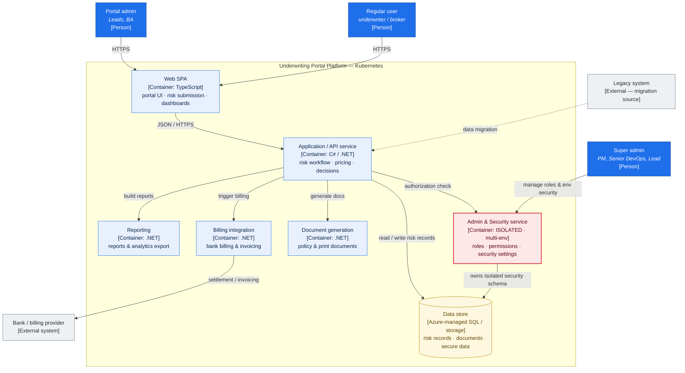

# C4 — Container Diagram (Level 2)

**System:** Underwriting & Insurance Portal Platform (Wonderland Inc.)
**Runtime:** all application containers run on **Kubernetes**.

## Reading the diagram

- **Three personas, three authority levels.** Regular users and portal admins reach the platform through the Web SPA; the super admin operates directly against the security service.
- **The Admin & Security service is deliberately isolated** (highlighted in red). Every request the API serves runs an authorization check against it, and it owns its **own security schema** inside the data store. This is the key architectural decision: roles, permissions, and security settings can be managed **across multiple environments without any other service touching the full database**, which shrinks the blast radius and hardens multi-environment governance.
- **The .NET application service is the hub** — it orchestrates the risk workflow and delegates to focused containers for document generation, billing, and reporting.
- **External edges** are the bank/billing provider (settlement) and the legacy system (one-directional migration source).

## Notes for the case study
- This is **Level 2 (Containers)**. A **Level 1 (System Context)** view would collapse the boundary into a single box with the three personas and two external systems — useful as the opening slide.
- A **Level 3 (Component)** zoom into the API or the Security service is where you'd show the role/permission model in detail, if a reviewer asks to go deeper.
- Swap the placeholder data-store technology for the exact Azure services you used (e.g. Azure SQL, Blob Storage) when you confirm them.
