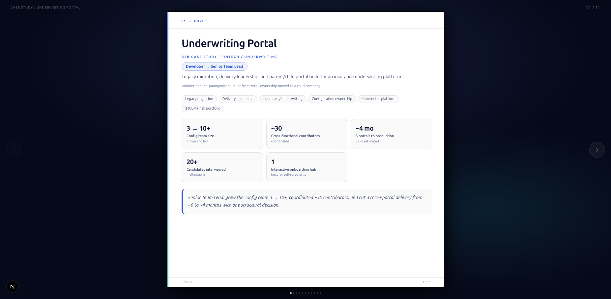
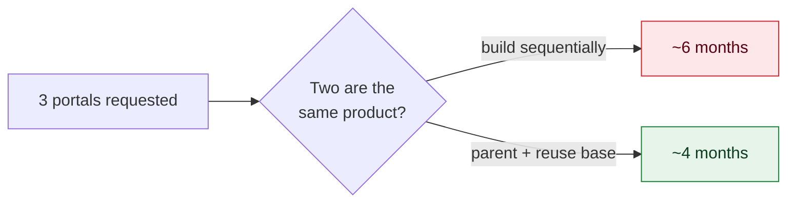
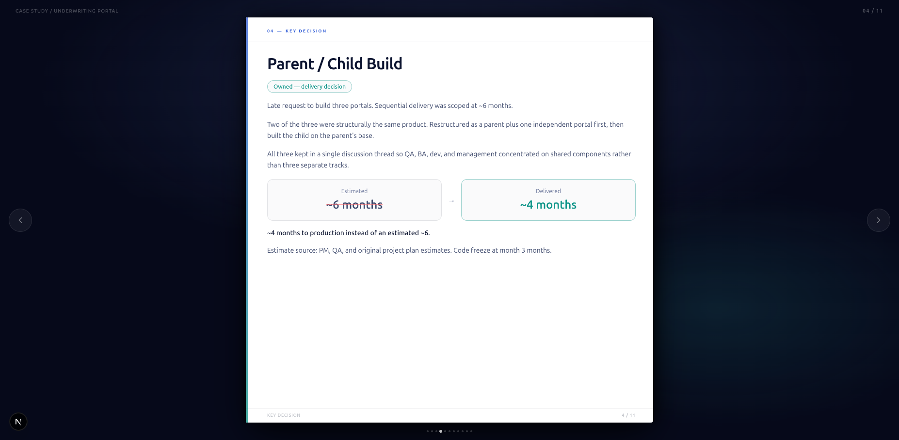
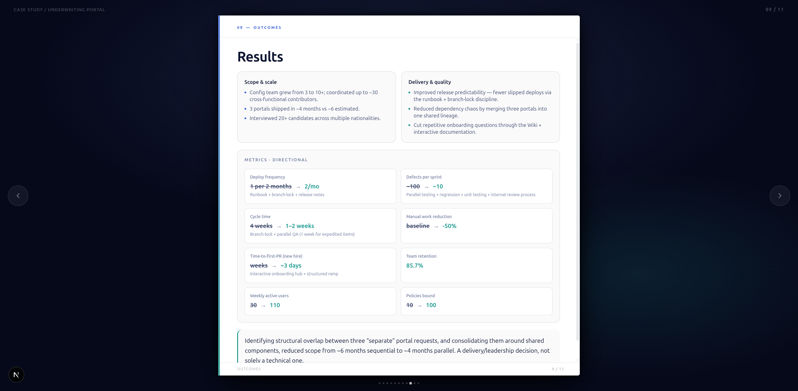
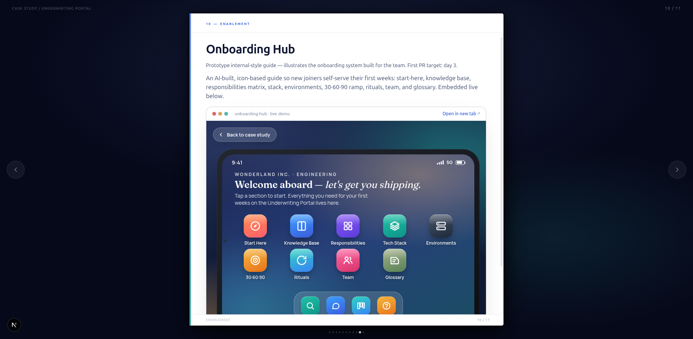
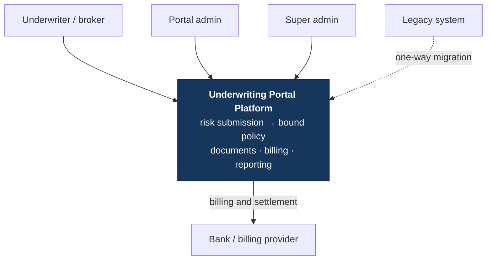
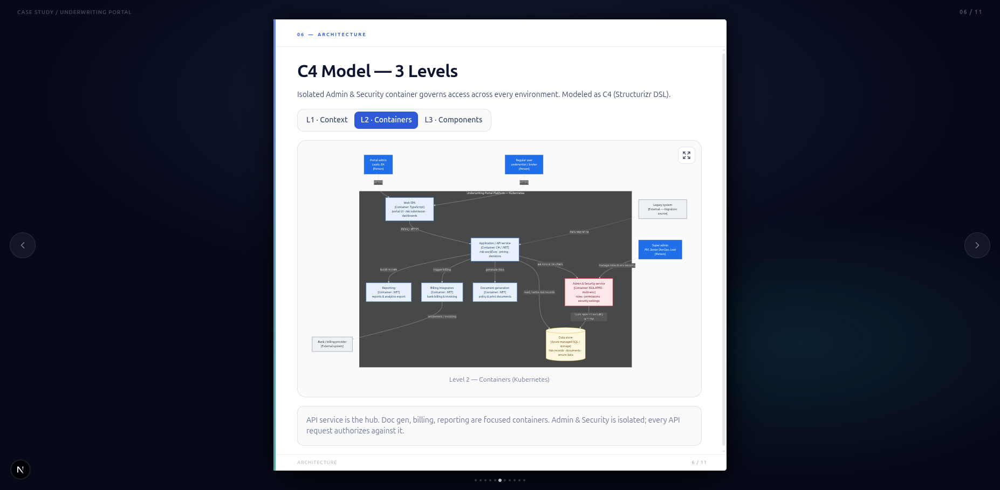

# Underwriting Portal — Delivery Case Study

> An interactive, keyboard-navigable **flip-book** that tells the story of shipping a B2B insurance underwriting platform: legacy migration, a team grown from 3 to 10+, and one structural decision that cut a three-portal delivery from ~6 months to ~4.

**▶ Live:** https://shatalov.dev/case-studies/underwriting-portal
**⬡ C4 architecture:** https://shatalov.dev/c4

<sub>Anonymized as *"Wonderland Inc."* Architecture is described as *influenced / advocated*; delivery and configuration as *owned*; people work as *coordinated*. Quantitative figures are directional.</sub>



---

## 1 · The experience

**Developer → Senior Team Lead** on a fintech underwriting platform — built from zero, then handed to a child company.

- **Grew and led the config team 3 → 10+**, coordinated **~30** cross-functional contributors (QA, BA, dev, DevOps, PM, client).
- **Interviewed 20+** candidates across multiple nationalities; owned hiring, onboarding, sprint planning, estimates, and delivery flow.
- **The decision that defined it:** a late request for **three** portals scoped at **~6 months**. Two were structurally the same product — restructured as a **parent + one independent portal**, then grew the third on the parent's base. **Shipped in ~4 months instead of ~6.** A delivery call, not a framework.





## 2 · The finances

A platform carrying a **$100M+ risk portfolio** — bank billing, settlement, and policy issuance are first-class, not afterthoughts.

| Metric | Before | After |
|---|---|---|
| **Policies bound** | 10 | **100** |
| **Weekly active users** | 30 | **110** |
| Deploy frequency | 1 / 2 months | **2 / month** |
| Defects per sprint | ~100 | **~10** |
| Cycle time | 4 weeks | **1–2 weeks** |
| Manual work | baseline | **−50%** |
| Team retention | — | **85.7%** |
| Time-to-first-PR (new hire) | weeks | **~3 days** |

Fewer defects, faster cycles, and a −50% manual-work cut translate straight into more bound policies and lower cost-to-serve on a high-value book.



## 3 · The tablet — the signature screen

The case study's hero is a **live, AI-built onboarding hub rendered as an iPad** — bezel, camera, status bar, glass UI — embedded right in the page, not a screenshot.

- It was **one of the first features shipped**: the self-serve ramp guide that took new hires from weeks to **~3 days to first PR**.
- Sectioned, icon-based, tap-through: start-here, knowledge base, RACI matrix, stack, environments, 30·60·90 ramp, rituals, team, glossary.
- Doubles as the visual centerpiece of the whole case study — a real product surface you can touch, mid-narrative.



---

## Also worth a look

- **It reads like a product, not a PDF.** 11 horizontal pages, arrow-key / dot navigation, page-flip motion. Built to be *clicked through*, not scrolled past.
- **Architecture as code, three zoom levels.** C4 model (Structurizr DSL) rendered L1→L3 in-page via Mermaid — context, containers, and a zoom into the isolated Admin & Security service whose single design call shrank the security blast radius.
- **Honest by construction.** Ownership is split into *owned / coordinated / influenced / delegated* so nothing is overclaimed. Confidential figures are marked, not faked.

---

## What's on each page

`Cover → The Problem → Role & ownership → Key decision → Delivery process → Architecture (C4) → Risk-record user flow → People & hiring → Outcomes → Onboarding hub → Deck appendix → Resources`

---

## Tech stack

- **Next.js 15** (App Router) · **React 19** · **TypeScript**
- **Tailwind CSS v4**
- **motion** (page-flip transitions) · **mermaid** (diagrams) · **lucide-react** (icons)
- **Static export** (`output: "export"`) under a `basePath`, hosted as a section of a static site
- **C4 site** generated from `structurizr/workspace.dsl` via [structurizr-site-generatr](https://github.com/avisi-cloud/structurizr-site-generatr)

A single content file — `content/underwriting-portal.ts` — is the source of truth for every line of copy, metric, and diagram. Components stay declarative.

---

## Run it locally

```bash
pnpm install
pnpm dev        # → http://localhost:3020/case-studies/underwriting-portal
```

> The app sets `basePath: "/case-studies/underwriting-portal"`, so the bare root (`/`) returns a 404 in dev. That's expected — open the path above.

## Build (static export)

```bash
pnpm build      # emits a self-contained static site to ./out
```

`out/` carries everything — routes, `_next` assets, the onboarding hub, and downloadable resources — all prefixed with the base path, so the folder drops under any static host at `…/case-studies/underwriting-portal/`.

## Deploy

The case study ships as a static section of [shatalov.dev](https://shatalov.dev):

1. `pnpm build` → `out/`
2. Copy `out/` into the portfolio at `case-studies/underwriting-portal/`
3. Deploy the portfolio site

The `/c4` site is generated separately (relative paths, safe under a subdirectory):

```bash
docker run --rm -v "$PWD/structurizr":/var/model -w /var/model \
  ghcr.io/avisi-cloud/structurizr-site-generatr generate-site -w workspace.dsl
```

---

## Project structure

```
app/
  page.tsx          # renders the book at the deploy root
  layout.tsx        # metadata + theme bootstrap
  globals.css       # tokens + book-viewer styles
components/
  BookApp.tsx       # page definitions (content → pages)
  BookViewer.tsx    # flip viewer (keyboard / arrows / dots)
  C4Tabs.tsx        # 3-level C4 viewer (L1/L2/L3 via Mermaid)
  MermaidDiagram.tsx, Zoomable.tsx
  DeliveryTimeline.tsx, OwnershipMatrix.tsx
  OnboardingDemo.tsx, ResourcesBlock.tsx
content/
  underwriting-portal.ts   # single source of truth: copy, metrics, diagrams
lib/
  base.ts           # BASE_PATH + asset() helper (base-path-aware URLs)
structurizr/
  workspace.dsl     # C4 model (architecture as code)
public/
  onboarding-hub.html      # embedded interactive onboarding guide
  resources/               # downloadable deck, DSL, architecture appendix
```

---

## Architecture in one paragraph

The platform is a .NET API service as the hub, with focused containers for document generation, billing, and reporting — all on Kubernetes. The **Admin & Security** container is deliberately isolated: every API request authorizes against it, and it owns its own security schema. Managing access *per environment* without touching the full database means a far smaller blast radius. See [`Architecture-Appendix-C4.md`](./Architecture-Appendix-C4.md) and [`structurizr/workspace.dsl`](./structurizr/workspace.dsl).





## Resources

- Executive deck (PDF, 12 slides) — `public/resources/underwriting-case-deck.pdf`
- C4 model (Structurizr DSL) — `structurizr/workspace.dsl`
- Architecture appendix (Markdown) — `Architecture-Appendix-C4.md`
- Full case write-up — `B2B-Case-Study-Underwriting-Portal.md`
</content>
</invoke>
