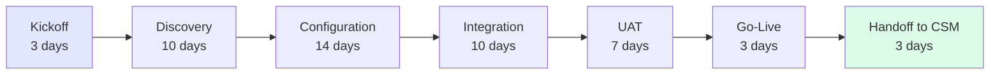
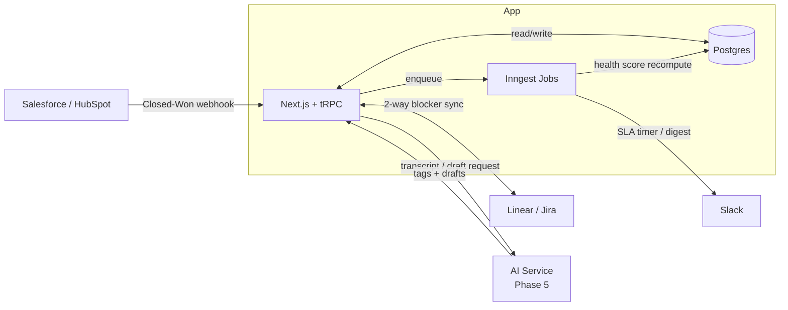
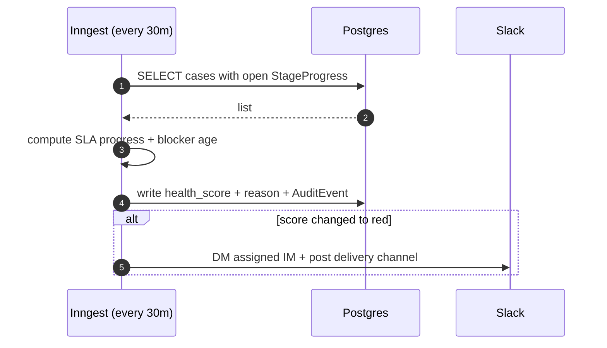
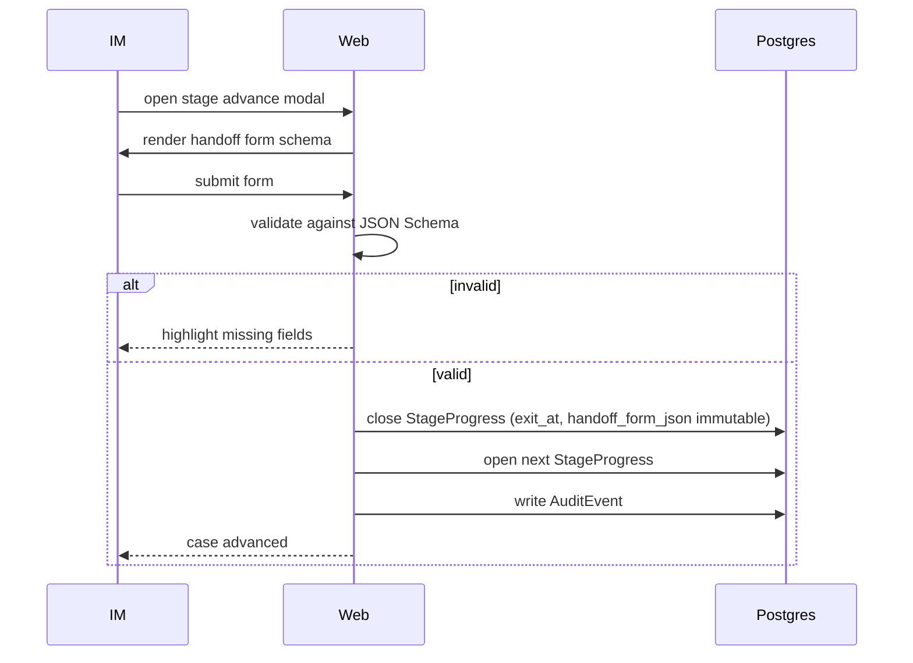
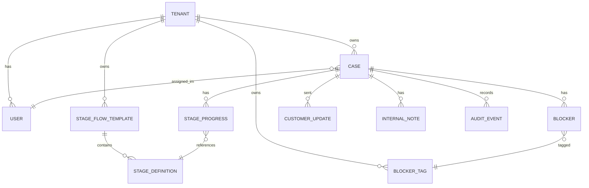

# SaaS Delivery Case Flow

> System of record for B2B SaaS implementation teams. Tracks each customer from contract-signed to go-live as a structured case with stage flow, SLA timers, handoffs, blocker log, and computed health score.

---

## Contents

1. [Problem](#problem)
2. [Personas](#personas)
3. [Stage Flow](#stage-flow)
4. [System Architecture](#system-architecture)
5. [Data Model](#data-model)
6. [Features](#features)
7. [Screens](#screens)
8. [Decisions](#decisions)
9. [Roadmap](#roadmap)
10. [Success Metrics](#success-metrics)

---

## Problem

B2B SaaS implementation (contract-signed → go-live) runs in Notion, a spreadsheet, and Slack threads. Three failures repeat:

1. **Silent slippage.** A case stalls in Configuration for three weeks because the customer's DevOps team is unresponsive. No alerts fire. The go-live date slips a month.
2. **Lossy handoffs.** Sales scoped X, Solutions built Y, Implementation delivered Z. Nobody writes the deltas. The customer notices at UAT.
3. **No portfolio view.** The VP knows which three cases are on fire this week. Cannot answer "what's our median time-to-live?" or "which blocker types cause 80% of slippage?"

Root cause: the implementation phase has no system of record. Existing tools (Notion, Jira, HubSpot) are general. This phase has a specific shape.

---

## Personas

| Persona | Role | Daily pain | Win state |
|---------|------|-----------|-----------|
| **Dani** | Implementation Manager | 8–15 active cases; status lives in Slack threads | One board, ranked by risk, with reason text |
| **Mateo** | VP of Customer Success | QBR prep = 2 days pulling from HubSpot + asking IMs over Slack | Portfolio dashboard + one-click export |
| **Sofia** | Customer Success Manager | Inherits accounts with no structured history; repeats questions | Handoff payload readable in 10 minutes |

---

## Stage Flow

Default 7-stage template. Each stage has: `sla_days`, `handoff_form_schema`, `required_role`.

```
Kickoff → Discovery → Configuration → Integration → UAT → Go-Live → Handoff to CSM
```

- Stage advance **requires** a complete handoff form — cannot be bypassed.
- Handoff records are immutable once the stage exits.
- Tenants can add/remove stages and edit SLAs. Cannot reorder defaults while cases are in-flight.
- Changing a template creates a new version; in-flight cases stay on their original version.



---

## System Architecture



### SLA breach sequence



### Stage advance sequence



### Components

| Component | Responsibility |
|-----------|----------------|
| Web (Next.js + tRPC) | Case board, case detail, portfolio, settings |
| Postgres | All state: cases, stages, handoffs, blockers, audit log |
| Inngest | SLA checks every 30m, weekly digests, blocker-age escalations |
| Resend | Customer-facing emails sent by IM |
| Slack | Internal alerts: SLA breach, new red case, stage advance |
| CRM sync | Inbound: Closed-Won → auto-create case. Outbound: case status → CRM field |
| Linear/Jira | Two-way blocker linking for engineering-tagged blockers (Phase 4) |
| AI service | Call transcript → blocker tags + customer-update draft (Phase 5) |

**Architecture:** Modular monolith, three layers:
- **Case layer** — CRUD on cases, stages, handoffs, blockers
- **Automation layer** — Inngest jobs, integrations, AI (never mutates state directly; calls case-layer API)
- **Reporting layer** — read-only views for VP dashboard + QBR exports

---

## Data Model



### Key fields

```
Case
  crm_opportunity_id          external ref (HubSpot / Salesforce)
  customer_company
  contract_value_usd
  target_go_live_date
  actual_go_live_date         nullable
  current_stage_id            → StageDefinition
  health_score                enum { green | yellow | red }
  health_reason               text — recomputed every 30m with score
  assigned_im_id              → User

StageProgress
  entered_at, exited_at       nullable
  sla_breached                boolean
  handoff_form_json           JSONB — immutable once exited_at is set

Blocker
  owner                       enum { us | customer | third_party }
  tag                         → BlockerTag (tenant dictionary)
  opened_at, resolved_at
  linked_ticket_url           Linear / Jira (Phase 4)
  description

AuditEvent                    append-only; PII never in plaintext
```

### Health score logic

```
green:  no open blockers > 5d AND no SLA breach in current stage
yellow: any blocker > 5d OR projected SLA breach within 3 days
red:    SLA breached OR blocker > 14d OR customer non-response > 10d
```

Thresholds are tenant-configurable. Score always persisted with `health_reason`.

### Indexes

| Table | Index |
|-------|-------|
| CASE | `(tenant_id, health_score, assigned_im_id)` |
| CASE | `(tenant_id, current_stage_id, days_in_stage DESC)` |
| BLOCKER | `(case_id, resolved_at) WHERE resolved_at IS NULL` |
| STAGE_PROGRESS | `(case_id, entered_at DESC)` |
| AUDIT_EVENT | `(tenant_id, case_id, created_at DESC)` |

---

## Features

| Feature | Description | Phase |
|---------|-------------|-------|
| Case board | IM's daily workspace — all cases by stage, ranked by risk | 1 |
| Case detail | Stage, health + reason, blocker log, notes, handoffs, audit log | 1 |
| Structured handoffs | Required form per stage advance; record immutable on exit | 1 |
| Blocker log | Owner, tag, age, resolution; linked to Linear/Jira in Ph4 | 1 |
| SLA timers | Per-stage SLA countdown; breach triggers health change + alert | 3 |
| Health score | Computed every 30m; stored with reason text | 3 |
| Portfolio dashboard | VP view — all cases sorted by risk, filterable by IM | 3 |
| Weekly digest | Auto-generated per case; Slack DM to IM every Monday 09:00 | 3 |
| Stage flow editor | Tenant admin: add/remove stages, edit SLAs, extend handoff forms | 2 |
| Customer portal | Read-only signed URL; customer can comment on blockers | 4 |
| AI auto-tag | Call transcript → suggested blocker tags (requires IM approval) | 5 |
| AI draft email | Customer-update draft from case history; IM edits and sends | 5 |
| QBR export | One-click PDF: time-to-live cohort, top blocker types, NRR inputs | 6 |

---

## Screens

### 1. Portfolio Dashboard (VP)

- 4 KPI cards: active cases · contract value at risk · SLA breaches · blockers >7d
- Cases table sorted red → yellow → green; reason text inline (not just a color dot)
- Filter by IM, health, stage
- Click row → Case Detail

### 2. Case Board (IM)

- Columns by stage: Kickoff → ... → Handoff to CSM
- Each card: customer name, days-in-stage, health dot, open-blocker count
- Filter: my cases / all / by health
- No drag-drop — advancement requires handoff form

### 3. Case Detail

- Header: customer, IM, contract value, target go-live, current stage, health + reason
- Tabs: Timeline · Blockers · Notes · Handoffs · Customer Comms · Audit Log
- Right rail: next milestone, projected SLA, "Share with customer" button

### 4. Stage Advance Modal

- Renders handoff form schema for the current stage
- Required fields gated; incomplete = blocked
- Preview pane shows the JSON that will be persisted
- On submit: creates immutable `StageProgress` record

### 5. Blocker Detail

- Owner, tag, age, description
- Linked Linear/Jira ticket (Phase 4)
- Comments thread (IM + customer if portal active)
- Resolution form

### 6. Customer Portal (Phase 4)

- Read-only signed URL; 60-day TTL, revocable by IM
- Shows: current stage, projected go-live, open blockers (customer/3rd-party only; internal hidden)
- Customer can comment on a blocker

### 7. Stage Flow Editor (Phase 2)

- Stages list; locked for in-flight cases
- Edit SLA per stage; extend handoff form schema (JSON Schema editor + visual preview)
- Publish = new template version; in-flight cases unaffected

### 8. QBR Export (Phase 6)

- Cohort time-to-live histogram
- Top 5 blocker tags by total age
- Escalation count + renewal-risk score
- Download PDF

---

## Decisions

| Decision | Alternative | Rationale |
|----------|-------------|-----------|
| Mandatory handoff forms | Optional prompts | Optional becomes decorative; mandatory creates the data substrate |
| Health score is computed | IM flags manually | Manual flagging is inconsistent across IMs; computed score is auditable |
| Constrained flow customization | Full flow-builder GUI | Flow-builder explodes scope and support burden; constraints cover 90% of real needs |
| Automation layer never mutates directly | Direct DB writes from jobs | Keeps audit log consistent; case layer is the single write path |
| Modular monolith | Microservices | Surface area doesn't justify it |
| AI features in Phase 5 | AI from day one | Need operational ground-truth data for eval set before trusting auto-tagging |
| IMs-first, customer portal Phase 4 | Customer-facing v1 | IM adoption is the bottleneck; portal adds scope without solving the core problem |

---

## Roadmap

| Phase | Scope | Exit criteria |
|-------|-------|---------------|
| **0 — Foundation** | Product spec, data model, stage flow, screen mocks, mock data | Document is legible; demo on paper |
| **1 — Single-tenant MVP** (5w) | Cases CRUD, 7-stage flow, handoff forms, blocker log, audit log | Pilot has 3+ active cases; 100% of advances through handoff form |
| **2 — Multi-tenant** (4w) | WorkOS SSO, tenant onboarding, stage flow editor, blocker tag dictionary | 3 paying tenants with non-default flows |
| **3 — Risk engine** (5w) | SLA timers, health score + reason, portfolio dashboard, weekly digest, Slack alerts | Pilot median time-to-live improves ≥15% |
| **4 — Integrations** (5w) | Linear/Jira 2-way blocker sync, customer read-only portal | 50% of eng-tagged blockers have linked ticket; one tenant activates portal |
| **5 — AI augmentations** (4w) | Transcript ingestion, auto-tag blockers, draft customer-update email | Auto-tag precision >85%; IM adoption of draft feature >60% |
| **6 — QBR exports** (3w) | Cohort analytics, blocker pattern library, PDF export | VP QBR prep time: 2 days → 2 hours |

---

## Success Metrics

| Metric | Baseline | Target (90 days) |
|--------|----------|-----------------|
| Median time-to-live | 64 days | ≤51 days (−20%) |
| Cases hitting target go-live | 38% | ≥63% |
| Median blocker age at resolution | 9.4 days | ≤6.5 days (−30%) |
| IM time on weekly status writeup | 90 min/wk | ≤15 min/wk |
| VP time-to-QBR-ready | 2 days | 2 hours |
| 90-day customer NPS | 4.6 | ≥7.0 |

---

## Supplementary Files

| File | Contents |
|------|----------|
| `architecture.md` | Architecture narrative + ASCII diagram |
| `product-brief.md` | Problem framing, personas, JTBD, differentiation |
| `acceptance-criteria.md` | Gherkin-style criteria per feature per phase |
| `roadmap.md` | Roadmap with risk/mitigation table |
| `diagrams/data-model.md` | ER diagram with index notes |
| `diagrams/system.md` | System + sequence diagrams |
| `docs/case-study.md` | Case study with user flows and design rationale |
| `screens/README.md` | Detailed screen specs |
| `ui/index.html` | Static HTML mockup (portfolio dashboard + case board) |
| `mock-data/` | Sample cases, blockers, stage-flow JSON |
