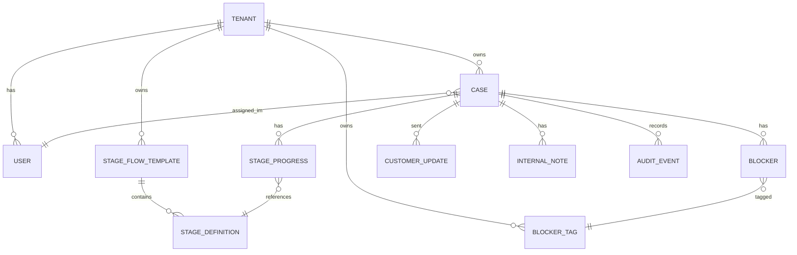

# Data Model

## Notes

- `STAGE_PROGRESS.handoff_form_json` is immutable once `exited_at` is set
- `CASE.health_score` and `health_reason` are derived; recomputed every 30 minutes
- `AUDIT_EVENT` is append-only; PII never logged in plaintext
- A `BLOCKER` belongs to exactly one `CASE`; cross-case linking is not modeled in v1
- `STAGE_FLOW_TEMPLATE` is versioned: changing a template creates a new version; in-flight cases stay on their template version

## Indexes

| Table | Index |
|-------|-------|
| CASE | (tenant_id, health_score, assigned_im_id) |
| CASE | (tenant_id, current_stage_id, days_in_stage desc) |
| BLOCKER | (case_id, resolved_at) where resolved_at IS NULL |
| STAGE_PROGRESS | (case_id, entered_at desc) |
| AUDIT_EVENT | (tenant_id, case_id, created_at desc) |
