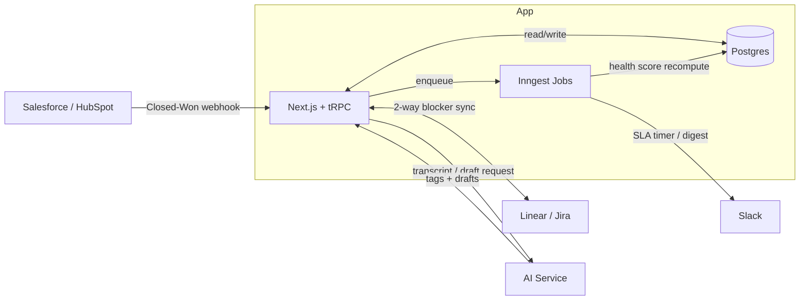
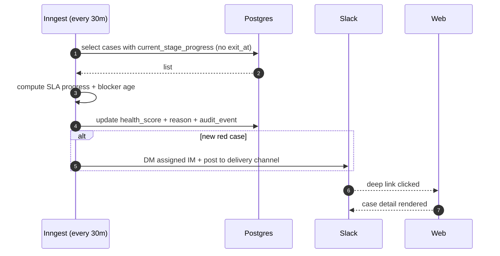
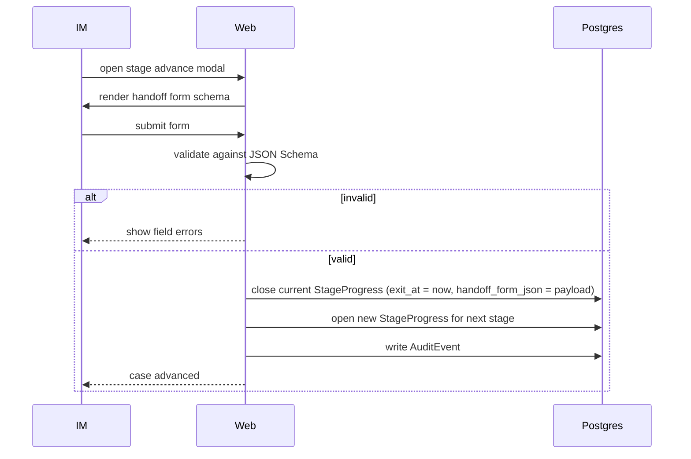

# System Diagram

```mermaid
flowchart LR
    CRM[Salesforce / HubSpot]
    Slack[Slack]
    Linear[Linear / Jira]
    AI[AI Service]

    subgraph App
      Web[Next.js + tRPC]
      DB[(Postgres)]
      Ing[Inngest Jobs]
    end

    CRM -->|Closed-Won webhook| Web
    Web <-->|read/write| DB
    Web -->|enqueue| Ing
    Ing -->|SLA timer / digest| Slack
    Ing -->|health score recompute| DB
    Web <-->|2-way blocker sync| Linear
    Web -->|transcript / draft request| AI
    AI -->|tags + drafts| Web
```

## Sequence: SLA breach detection

```mermaid
sequenceDiagram
    autonumber
    participant J as Inngest (every 30m)
    participant DB as Postgres
    participant Slk as Slack
    participant W as Web

    J->>DB: select cases with current_stage_progress (no exit_at)
    DB-->>J: list
    J->>J: compute SLA progress + blocker age
    J->>DB: update health_score + reason + audit_event
    alt new red case
      J->>Slk: DM assigned IM + post to delivery channel
    end
    Slk-->>W: deep link clicked
    W-->>Slk: case detail rendered
```

## Sequence: Stage advance

```mermaid
sequenceDiagram
    participant IM
    participant W as Web
    participant DB as Postgres

    IM->>W: open stage advance modal
    W->>IM: render handoff form schema
    IM->>W: submit form
    W->>W: validate against JSON Schema
    alt invalid
      W-->>IM: show field errors
    else valid
      W->>DB: close current StageProgress (exit_at = now, handoff_form_json = payload)
      W->>DB: open new StageProgress for next stage
      W->>DB: write AuditEvent
      W-->>IM: case advanced
    end
```
